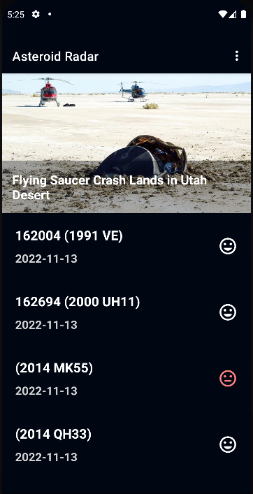
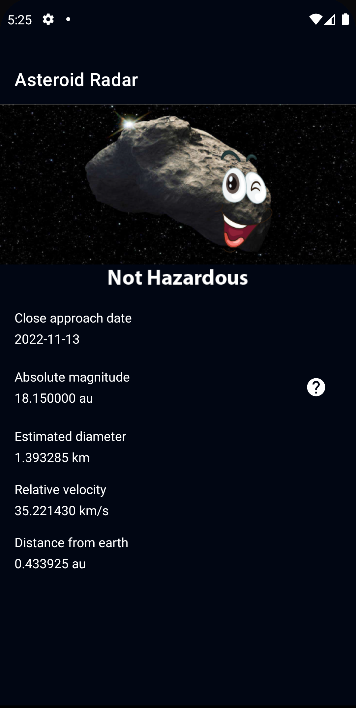

# Note
kindly visit https://api.nasa.gov/ and register to gek api key to use it in the app
put the key in this direction  Asteriod\app\src\main\java\com\example\asteriod\api\Service.kt
in line 40 replace you key with enter_your_key :  @GET("neo/rest/v1/feed?api_key=enter_your_key") 
## Android Asteroid 

The Android Asteriod application is an application that give the user information about Android Asteroid.  It makes use of the Navigation component within Jetpack to move the user between different screens.  Each screen is implemented as a Fragment.
The app navigates using views , app created using MVVM , Repository , offline caching using Room Database

## Screenshots

 

